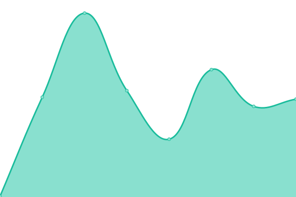
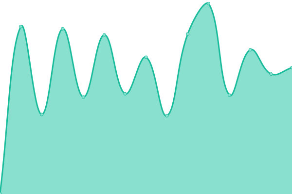

# [📈 Live Status](https://status.digintlab.com): <!--live status--> **🟩 All systems operational**

This repository contains the open-source uptime monitor and status page for [DigintLab](https://status.digintlab.com), powered by [Upptime](https://github.com/upptime/upptime).

With [Upptime](https://upptime.js.org), you can get your own unlimited and free uptime monitor and status page, powered entirely by a GitHub repository. We use [Issues](https://github.com/DigintLab/infra-status/issues) as incident reports, [Actions](https://github.com/DigintLab/infra-status/actions) as uptime monitors, and [Pages](https://status.digintlab.com) for the status page.

<!--start: status pages-->
<!-- This summary is generated by Upptime (https://github.com/upptime/upptime) -->
<!-- Do not edit this manually, your changes will be overwritten -->
<!-- prettier-ignore -->
| URL | Status | History | Response Time | Uptime |
| --- | ------ | ------- | ------------- | ------ |
|  [Company Website](https://doubleextortion.com) | 🟩 Up | [company-website.yml](https://github.com/DigintLab/infra-status/commits/HEAD/history/company-website.yml) | 

 145ms
     
 | 

<a href="https://status.digintlab.com/history/company-website">100.00%</a>
    

|  [Platform Frontend](https://app.doubleextortion.com) | 🟩 Up | [platform-frontend.yml](https://github.com/DigintLab/infra-status/commits/HEAD/history/platform-frontend.yml) | 

 220ms
     
 | 

<a href="https://status.digintlab.com/history/platform-frontend">100.00%</a>
    

|  [Platform Authentication Endpoint (prod)](https://auth.eu-ep1.doubleextortion.com) | 🟩 Up | [platform-authentication-endpoint-prod.yml](https://github.com/DigintLab/infra-status/commits/HEAD/history/platform-authentication-endpoint-prod.yml) | 

 564ms
     
 | 

<a href="https://status.digintlab.com/history/platform-authentication-endpoint-prod">100.00%</a>
    

|  [Platform Primary API Endpoint (prod)](https://api.eu-ep1.doubleextortion.com/v1/) | 🟩 Up | [platform-primary-api-endpoint-prod.yml](https://github.com/DigintLab/infra-status/commits/HEAD/history/platform-primary-api-endpoint-prod.yml) | 

 437ms
     
 | 

<a href="https://status.digintlab.com/history/platform-primary-api-endpoint-prod">100.00%</a>
    

|  [Platform Secondary API Endpoint (prod)](https://api.eu-ep1b.doubleextortion.com/v1/) | 🟩 Up | [platform-secondary-api-endpoint-prod.yml](https://github.com/DigintLab/infra-status/commits/HEAD/history/platform-secondary-api-endpoint-prod.yml) | 

 378ms
     
 | 

<a href="https://status.digintlab.com/history/platform-secondary-api-endpoint-prod">100.00%</a>
    

<!--end: status pages-->

[**Visit our status website →**](https://status.digintlab.com)

## 📄 License

- Powered by: [Upptime](https://github.com/upptime/upptime)
- Code: [MIT](./LICENSE) © [Anand Chowdhary](https://anandchowdhary.com), supported by [Pabio](https://pabio.com)
- Data in the `./history` directory: [Open Database License](https://opendatacommons.org/licenses/odbl/1-0/)
